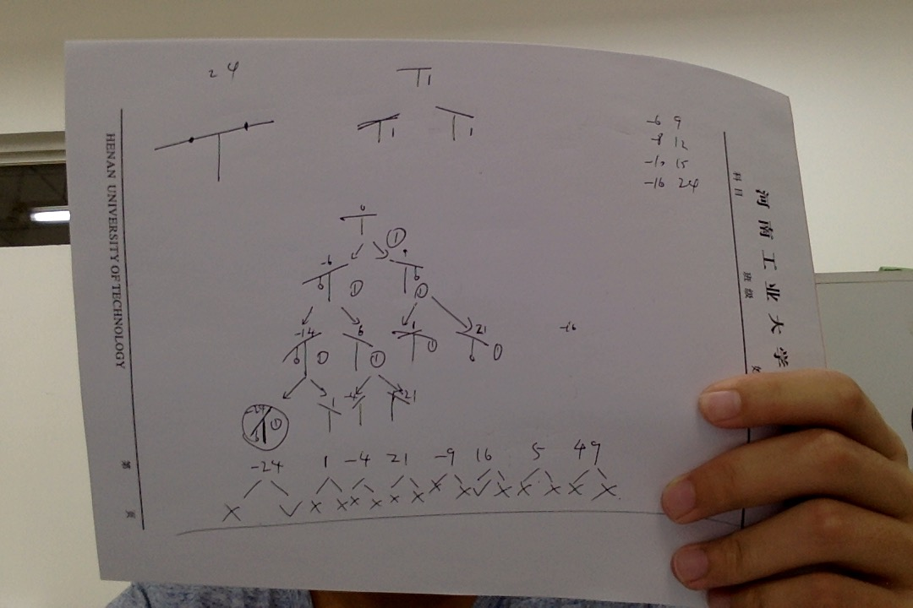

## 参考链接
[题解](http://blog.csdn.net/lyy289065406/article/details/6648094/)
## 思路
	就是给每种天平的状态都拍一个镜象，第一层循环表示放到前i个砝码，第二层循环搜索所有可能的天平角度。
	第三层循环代表当前正在放置的砝码放在那个挂钩上。这样就可以做到将所有的状态都覆盖到。
	然后当前的角度状态，肯定是由放置上一个砝码时所产生的角度状态所转变过来的，所以递推式就是
	[放置第i个砝码后][所产生的角度]的状态数 += [放置第i个砝码前][所产生的角度]的状态数
## 图片参考

>这个是样例的状态镜象图