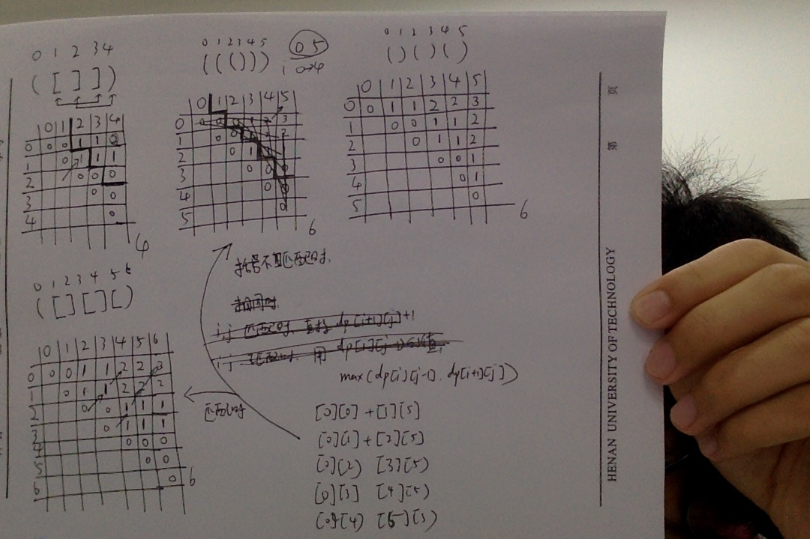

  
  <h3 align="center">Stone</h3>
<!--   

  Write
  The 
  Code,
  Change
  The
  World.
     
  
 -->
  

    
  

 

## 题目

>[这里是题目哦](http://poj.org/problem?id=2955)

## 题解

>[这里是题解哦](http://blog.csdn.net/mikasa3/article/details/51523563)

## 思路

    下图是这题的动态规划转移的过程。

## 总结

	wait...... 