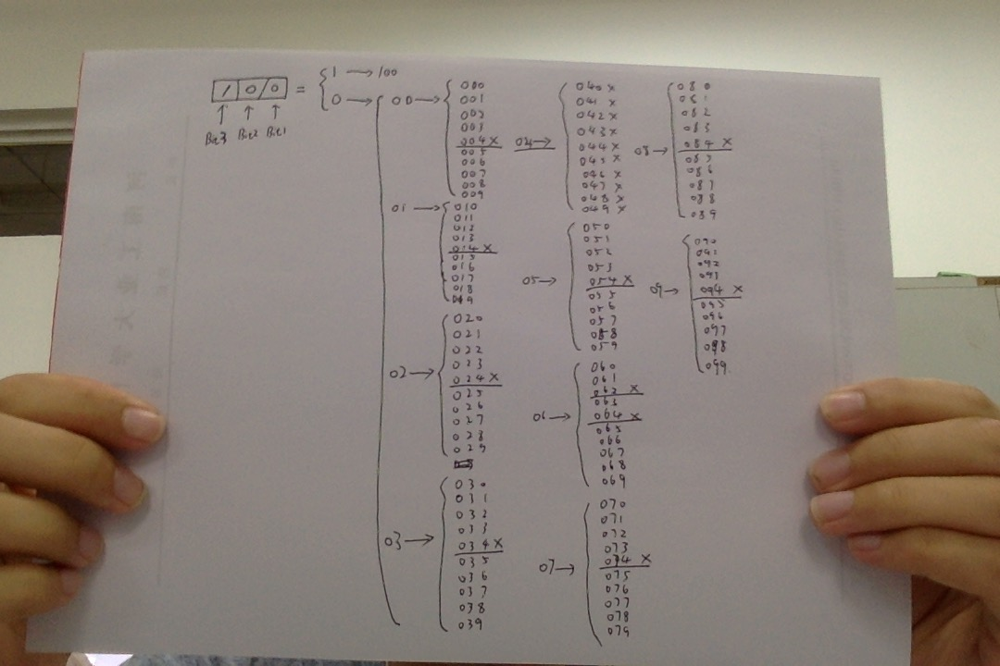

<p align="center">
  <a href="http://shallweitalk.com">
    
  </a>
  <h3 align="center">Stone</h3>
<!--   <p align="center">
  <span style="color: #D96045">Write</span>
  <span style="color: #449AD8">The</span> 
  <span style="color: #64C271">Code,</span>
  <span style="color: #EDC233">Change</span>
  <span style="color: #449AD8">The</span>
  <span style="color: #D96045">World.</span>
    <br>
  </p> -->
  <p align="center">
    <a href="http://shallweitalk.com">
      
    </a>
  </p>
</p>
<br>

## 题目

>[这里是题目哦](http://acm.hdu.edu.cn/showproblem.php?pid=2089)

## 题解

>[这里是题解哦](http://blog.csdn.net/ssimple_y/article/details/52215116)

## 手算分析问题

网上和很多博客都直接抛代码，根本没有好好解释这道题的思路是什么，真的一点用都没有，反而助长了抄袭的风气。
只有先模拟一遍手算的思路才能发现可以用dp优化的地方到底在哪里。这里我们就通过模拟手算的方式来理解代码。

    就用题目中的样例(1, 100)为🌰，如果让你按数位一位位纯暴力算你会怎么算？👇



    这样的话很明显就是O(n)的复杂度了，但是我们也可以从中发现一些问题，因为有的部分被重复计算了，再看下面这一张表。


对于大部分的来说，他们可以使用的数字数都是9， 而只有在60的那一组里，因为62存在的关系变成了8.那么这时
我们就可以发现，其实9的部分相当于是重复计算了，因为只要十位不是6，个位和十位组合出来的符合条件的数字
个数都是9，存暴力的时候我们把个位全部数了，但是实际上我们只要把各位数两遍，分别是：
    
    十位是6 ------- 8种 ------ dp[个位(1)][1];     dp[1][1] = 8;
    十位不是6 ------ 9种 ------ dp[个位(1)][0];     dp[1][0] = 9;
    推广：
    百位是6 ------- 71种 ------ dp[十位(2)][1];    dp[2][1] = 71;
    百位不是6 ------ 80种 ------ dp[十位(2)][0];    dp[2][0] = 80;

如果我们能把这两种情况对应的种数存下来，那么就可以省去大部分的时间了，这也正是数位dp所做到的东西。

## coding

这道题的思路代码实现不好理解，我看了好多网上的代码，思路都不好好解释，直接就抛代码。重点是，代码
中相关的变量名TM的就不能起一个能帮助人理解的名字吗，全是TM (fp, len, s) 我不信你TM过一段时间再
回来看还能看懂，这些参差不齐的代码，真是没有意思。这里的代码全部用了有助于人理解的变量名，并且我有写
详细的思路，帮助快速回忆起数位DP的基本思想。

```cpp
const int N = 110;

int dp[N][N];
int bitMapping[N];
int l, r;

int dfs(int bitNow, bool preBitIs6, bool beLimited)
{
    if(bitNow == 0) return 1;
    if(!beLimited && dp[bitNow][preBitIs6] != -1) return dp[bitNow][preBitIs6];

    int res = 0;

    int the_maxNumer_bitNow_can_reach;
    if(beLimited){
        the_maxNumer_bitNow_can_reach = bitMapping[bitNow];
    }else{
        the_maxNumer_bitNow_can_reach = 9;
    }

    for(int i=0;i<=the_maxNumer_bitNow_can_reach;i++){
        if(i == 4 || (preBitIs6 && i == 2)) continue;
        res += dfs(bitNow-1, i==6, beLimited && i == the_maxNumer_bitNow_can_reach);
    }

    if(!beLimited) dp[bitNow][preBitIs6] = res;
    return res;
}

int solve(int x)
{
    int all = 0;
    while(x){
        bitMapping[++all] = x%10;
        x /= 10;
    }
    return dfs(all, false, true);
}

int main(void)
{   
    memset(dp, -1, sizeof(dp));
    while(~scanf("%d%d", &l, &r)){
        if(l == 0 && r == 0) break;
        printf("%d\n", solve(r) - solve(l-1));
    }
    return 0;
}
```

## 思路

那么现在就是重头戏了，我们来解释一下代码的实现部分，主函数里面的内容不必多说了。唯一要说的就是这个

```cpp
    printf("%d\n", solve(r) - solve(l-1));
``` 
为了求出任意区间，但是我们在的方法是从0开始数的，那要用用从0数到右端点的值，减去从0数到左端点的前一个数的值就好了。

然后solve函数里调用dfs前的部分就是让数字的位与数组下标相对应罢了。这个还是很好理解的，不懂的话，只要
调试运行一下就明白了。

然后就是最关键的dfs部分，这里先来解释一下参数

```cpp
    int dfs(int bitNow, bool preBitIs6, bool beLimited)
```
`bitNow` 代表现在判断的的是第几位，十位的话就是2， 百位的话就是3， 数完了的话自然就是0了。

`preBitIs6` 代表现在判断的这位的前一位是不是6， 因为如果前一位是6的话，这一位就不能是2了。需要特殊判断。

`beLimited` 代表现在这位的取值范围是不是受到了限制，比如123，当十位取1的时候个位的取值没有受到限制
可以取0->9，但是当十位取2的时候，很明显个位不能取4，因为124 > 123。个位的取值受到了限制，只能取
0->3

```cpp
    if(bitNow == 0) return 1;
    if(!beLimited && dp[bitNow][preBitIs6] != -1) return dp[bitNow][preBitIs6];
```

上面是递归的返回条件，可见， 当找完所有的位时，我们需要返回加1，或者是这一位的取值没有受限，而且在这一位
的取值情况已知被保存在dp数组里时，直接返回值， 省去了重复计算的时间。

```cpp
    int res = 0;

    int the_maxNumer_bitNow_can_reach;
    if(beLimited){
        the_maxNumer_bitNow_can_reach = bitMapping[bitNow];
    }else{
        the_maxNumer_bitNow_can_reach = 9;
    }
```
很明显，在没有直接可用的值时，我们就没办法偷懒了，只好一个一个的向下暴力枚举了，所以当取值受限的
时候，我们能取到的最大值就是原数字当前位的值，比如123， 当十位是2时，个位的取值受限，最大取值
只能是3。而在不受县的情况下，自然就是9了。

```cpp
    for(int i=0;i<=the_maxNumer_bitNow_can_reach;i++){
        if(i == 4 || (preBitIs6 && i == 2)) continue;
        res += dfs(bitNow-1, i==6, beLimited && i == the_maxNumer_bitNow_can_reach);
    }

    if(!beLimited) dp[bitNow][preBitIs6] = res;
    return res;
```
那，省下的自然就是枚举了，对于不符合条件的情况我们直接就跳掉不看了，就是刚开始那张图里被❌掉的那
几个数字。同时这里也是根据题意改的最多的地方（应该），之后在搜下一位，根据现在位的情况，判断下一位的取值是否
受限制。最后在递归结束后，如果结果是一个不受限制请况下取得的一个完整值的话，就保存下来。以供后面偷懒的时候
用。

## 总结

	这题我看了一上午，理解的差不多了才来写的题解，在写题解的过程中，发现慢慢的已经全部理解了，有很多
    理解都是写题解的时候才明白的。看来写题解也是蛮有用的，好了，现在我终于可以自信的去把这道题给交了