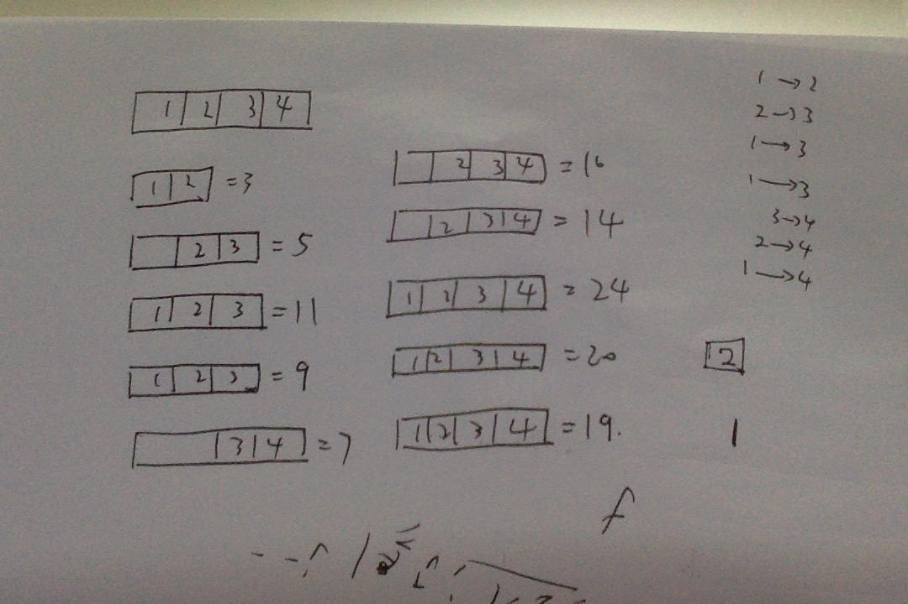

<p align="center">
  <a href="http://shallweitalk.com">
    
  </a>
  <h3 align="center">Stone</h3>
  <p align="center">
    <a href="http://shallweitalk.com">
      
    </a>
  </p>
</p>
<br>

## 一道题引发的对DP深深的思考

DP这东西，到现在为止，我还没有真正的做出过一道题来，说真的，DP就是我的一道瓶颈了。
思维总是绕不过来弯，学的比别人慢有什么办法呢，唉，不是我悲观，我知道我的脑子，到底
好不好使，做算法对于我来说太艰难了，但是，我一直告诉自己现在还没有到放弃时候呢，才这种程度
就放弃了，岂不是很对不起自己，很对不起算法？仔细想想，我除了代码意外，就没有什么可以寄托的东西了，
我活着的价值就是为了敲代码。代码是我最后信赖的伙伴了，如果我放弃了，我就真的什么都不剩了。我没有退路了。
做一个优秀的程序员，就是我唯一的希望， 唯一的寄托， 唯一的目标，所以，绝不能在这里就放弃啊。无论如何。
也要坚持下去，为代码献出心脏，与其签订的契约一定要实现。

## 题目

>[这里是题目哦](https://www.51nod.com/question/index.html#!questionId=777)

## 题解

>[这里是题解哦](http://www.cnblogs.com/zhang-yd/p/6858494.html)

## 思路

这道题我完全被上面的题解给误导了，上面这份题解做了一些难以理解的多余工作，搞得我理解错了。
这道题的主题就是从小区间推到大区间，关键在于先搞什么小区间。从题意中，我们能发现一些线索，首先
自己和自己的单一区间合并是不需要成本的，所以dp[i][i] = 0，另外我们很明显要从小区间推往大区间，
那么下一个大区间的大小便是2，这样的话，我们就可以像下面这样拓展。

```cpp
for(int j=1;j<=n;j++){
    for(int i=j-1;i>=1;i--){
        for(int k=i;k<=j;k++){
            dp[i][j] = min(dp[i][j], dp[i][k] + dp[k+1][j] + sum[i][j]);
        }
    }
}
```
这其中，i是区块的左端点，j是区块的右端点，区块的长度逐渐从1n，然后k在其中做一个划分，将所有不同 -->
子块合并的方式全部求一遍，从而求出最小的值。

    以n=4,(1,2,3,4)为例，区块的范围变化如下图


## 总结

	wait...... 